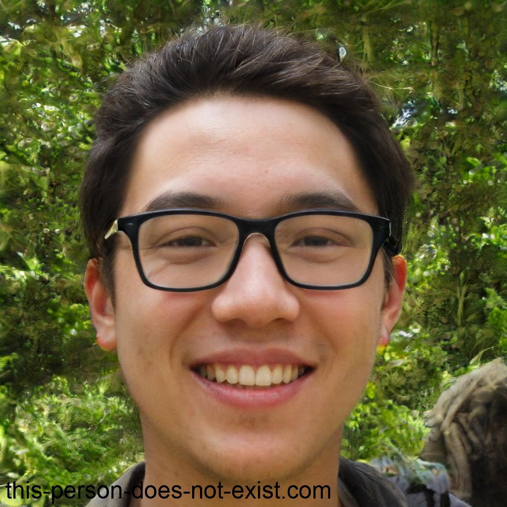
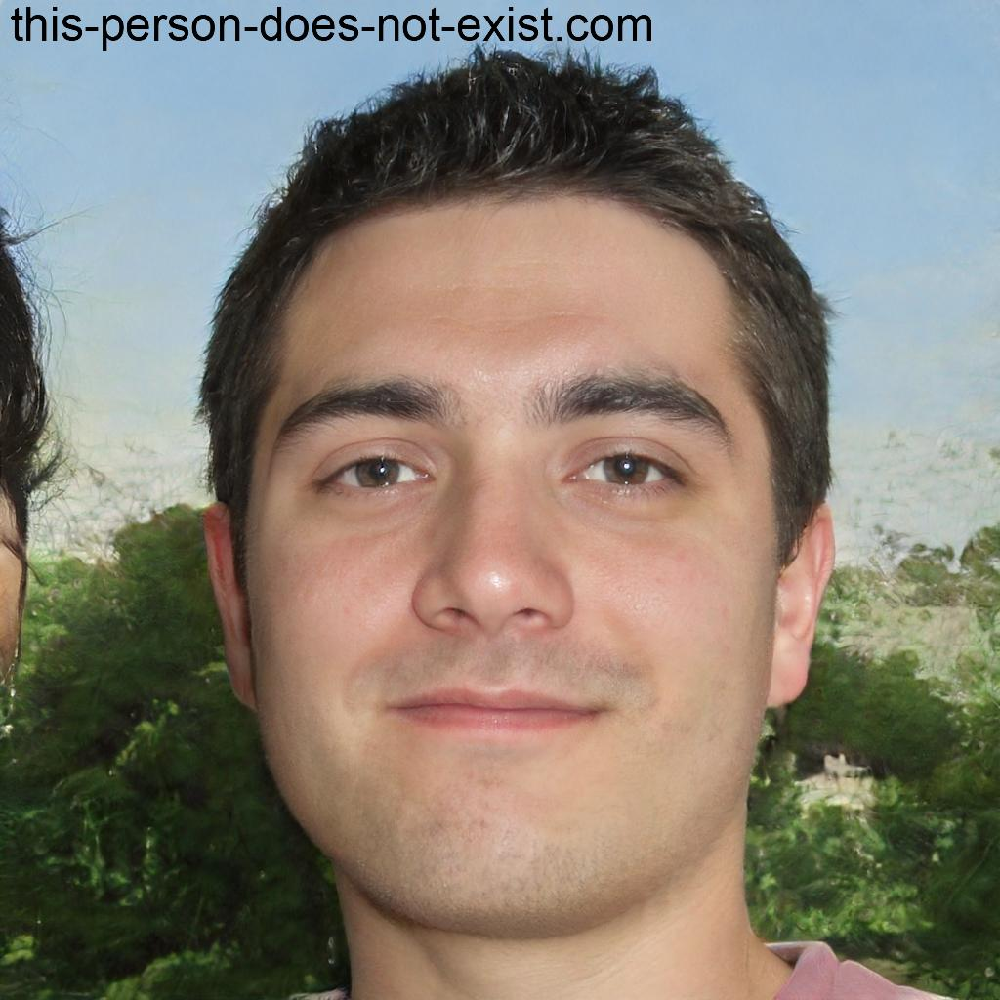

# Personas

## Introdução

Este documento visa documentar a criação das **Personas** para o aplicativo do **Cadastro Único**, como parte do processo de elicitação de requisitos.

## Metodologia

A criação dessa documentação foi elaborada a partir da coleta de dados por meio de pesquisas, [entrevistas]() e análise de [perfis de usuários]() reais, os quais forneceram as informações necessárias para a construção das personas, representando os diferentes perfis de público do aplicativo.

As imagens utilizadas no decorrer do documento foram geradas utilizando o site [This Person Does Not Exist](https://this-person-does-not-exist.com/pt), que cria imagens realistas com inteligência artificial, tornando as representações mais concretas e facilitando o entendimento. Além disso, o [ChatGPT](https://chatgpt.com) foi utilizado com o intuito de gerar os nomes das personas.

## O que são Personas?

As personas são representações **fictícias**, detalhadas e baseadas em **dados reais**, que sintetizam o comportamento, os objetivos e os desafios típicos de quem interage com o sistema. Elas ajudam a entender melhor as necessidades do público e orientar decisões de desenvolvimento.

## Categorias de Personas

As personas foram divididas em três categorias para refletir a diversidade de perfis de usuários que interagem com o aplicativo:

- **Personas Primárias:** Usuários diretos do sistema, que interagem com o aplicativo de forma constante.
- **Personas Secundárias:** Usuários que, embora não sejam os principais, influenciam o uso do sistema ou se beneficiam dele indiretamente.
- **Antipersonas:** Usuários que têm dificuldades ou não se beneficiam da utilização do sistema.

## Elenco

As Tabelas de 1 a 6 apresentam as personas criadas para o aplicativo, seguindo as categorias definidas anteriormente.

<strong>Tabela 1:</strong> Persona Primária 1

|**Persona Primária 1**|**Maria das Dores Silva**|
|:--:|:--:|
|**Foto:**|
<strong>Figura 1:</strong> Foto de Maria das Dores Silva
 
<strong>Autor:</strong> Amanda Cruz, 2025
|
|**Idade**:|54 anos|
|**Ocupação**:|Trabalhadora informal (vende doces de porta em porta)|
|**Localização**:|São Sebastião - DF|
|**Escolaridade**:|Ensino Fundamental Incompleto|
|**Tecnologia**:|Celular simples com acesso limitado à internet (plano pré-pago)|
|**Habilidades Digitais**:|Limitadas, tem pouca experiência com aplicativos e sistemas digitais|
|**Expectativas**:|Atualizar dados e evitar viagens ao CRAS|
|**Frustrações**:|Dificuldade com a navegação no app e problemas com a conexão de internet|
|**Cenário de Uso**:|Precisa ir ao CRAS frequentemente por conta da lentidão no envio de documentos e dificuldades no uso do app|
|**Descrição**:|Maria é uma trabalhadora informal que busca garantir o acesso ao Bolsa Família e facilitar a atualização dos dados pessoais sem precisar se deslocar ao CRAS|
|**Justificativa**:|Essa persona foi construída a partir de entrevistas com usuárias reais do CadÚnico, especialmente em áreas com baixa conectividade e de alta vulnerabilidade social. Ela representa os desafios enfrentados por pessoas com baixa escolaridade e familiaridade com tecnologia|

<strong>Autora:</strong> Amanda Cruz, 2025

--- 

<strong>Tabela 2:</strong> Persona Primária 2

|**Persona Primária 2**|**João Batista de Souza**|
|:--:|:--:|
|**Foto**:|
<strong>Figura 1:</strong> Foto de João Batista de Souza

<strong>Autor:</strong> Amanda Cruz, 2025
|
|**Idade**:|38 anos|
|**Ocupação**:|Pedreiro autônomo|
|**Localização**:|Taguatinga - DF|
|**Escolaridade**:|Ensino Médio Completo|
|**Tecnologia**:|Smartphone simples, usa internet móvel (plano pré-pago)|
|**Habilidades Digitais**:|Conhecimento básico, tem dificuldades|
|**Expectativas**:|Atualizar dados rapidamente para evitar burocracia e longas esperas|
|**Frustrações**:|Dificuldades em entender o formulário, conexão instável e a falta de clareza sobre o status do cadastro|
|**Cenário de Uso**:|João muitas vezes se sente decepcionado ao tentar preencher os formulários do app, especialmente devido à falta de clareza nas instruções. Fora isso, ele não sabe se a atualização foi bem-sucedida e, por isso, acaba fazendo várias tentativas de envio sem sucesso|
|**Descrição**:|João é um pedreiro autônomo que precisa manter os dados da sua família atualizados para conseguir o Auxílio Emergencial, mas enfrenta dificuldades devido à complexidade do sistema|
|**Justificativa**:|A persona foi construída com base no perfil de trabalhadores informais, que têm dificuldades com o uso de tecnologias e preferem uma experiência de usuário mais simples e direta, sem muitos obstáculos.|

<strong>Autora:</strong> Amanda Cruz, 2025

---

<strong>Tabela 3:</strong> Persona Secundária 1

|**Persona Secundária 1**|**Thiago Henrique Takahashi**|
|:--:|:--:|
|**Foto:**|
<strong>Figura 1:</strong> Foto de Thiago Henrique Takahashi 

<strong>Autor:</strong> Amanda Cruz, 2025
|
|**Idade**:|22 anos|
|**Ocupação**:|Estudante universitário|
|**Localização**:|Gama - DF|
|**Escolaridade**:|Ensino Superior em Andamento|
|**Tecnologia**:|Smartphone com internet móvel e computador em casa|
|**Habilidades Digitais**:|Alta alfabetização digital, experiência com aplicativos e plataformas online, usa dispositivos modernos e facilita o uso de tecnologia para sua família|
|**Expectativas**:|Atualizar dados rapidamente e ajudar seus pais com o uso|
|**Frustrações**:|A interface nem sempre é responsiva e falta clareza nas notificações|
|**Cenário de Uso**:|Usa semanalmente para verificar pendências e deseja uma área mais integrada para acompanhar a família|
|**Descrição**:|Thiago é um estudante universitário que ajuda sua família a manter os dados atualizados e acompanha a situação em tempo real|
|**Justificativa**:|Thiago representa a persona digitalmente alfabetizada que media o uso de tecnologia pública dentro da família. Ele desempenha um papel importante no auxílio de familiares de baixa renda, especialmente em famílias onde a alfabetização digital é limitada|

<strong>Autora:</strong> Amanda Cruz, 2025

---

<strong>Tabela 4:</strong> Persona Secundária 2

|**Persona Secundária 2**|**Carlos Eduardo Lima**|
|:--:|:--:|
|**Foto**:|
<strong>Figura 1:</strong> Foto de Carlos Eduardo Lima

<strong>Autor:</strong> Amanda Cruz, 2025
|
|**Idade**:|63 anos|
|**Ocupação**:|Aposentado|
|**Localização**:|Sobradinho - DF|
|**Escolaridade**:|Ensino Fundamental Completo|
|**Tecnologia**:|Celular simples com acesso à internet de baixa qualidade|
|**Habilidades Digitais**:|Básicas, com dificuldades em sistemas mais complexos.|
|**Expectativas**:|Manter o cadastro atualizado e obter suporte por telefone ou WhatsApp|
|**Frustrações**:|Dificuldade com a navegação e problemas ao enviar documentos devido à conexão lenta, sente que não possui um suporte adequado|
|**Cenário de Uso**:|Enfrenta dificuldades na navegação do app e gostaria de contar com suporte mais direto|
|**Descrição**:|Carlos é um aposentado que deseja manter o Cadastro Único atualizado para continuar acessando o Benefício de Prestação Continuada e espera suporte mais direto|
|**Justificativa**:|Esta persona reflete as dificuldades de pessoas idosas que precisam de interfaces mais simples e suporte mais direto para superar as barreiras tecnológicas|

<strong>Autora:</strong> Amanda Cruz, 2025

---

<strong>Tabela 5:</strong> Antipersona 1

|**Antipersona 1**|**Fernanda Martins**|
|:--:|:--:|
|**Foto**:|
<strong>Figura 1:</strong> Foto de Fernanda Martins

<strong>Autor:</strong> Amanda Cruz, 2025
|
|**Idade**:|22 anos|
|**Ocupação**:|Analista de TI|
|**Localização**:|Brasília - DF|
|**Escolaridade**:|Ensino Superior completo em Tecnologia da Informação|
|**Tecnologia**:|Smartphone moderno, laptop de última geração, acesso rápido à internet|
|**Habilidades Digitais**:|Alta alfabetização digital, especialista em TI, com habilidades avançadas em tecnologia e sistemas complexos|
|**Expectativas**:|Nenhuma, já que não utiliza o aplicativo, apenas tem curiosidade|
|**Frustrações**:|Acha básico demais e  não se aplica às suas necessidades, tornando a experiência desinteressante|
|**Cenário de Uso**:|Baixa por curiosidade, mas perde o interesse rapidamente|
|**Descrição**:|Fernanda é uma analista de TI que não depende de benefícios sociais e vê o app como irrelevante para suas necessidades|
|**Justificativa**:|Esta antipersona reflete indivíduos que não fazem parte do público-alvo do aplicativo, pois não dependem de serviços sociais e possuem expectativas diferentes sobre o uso de tecnologias públicas|

<strong>Autora:</strong> Amanda Cruz, 2025

---

<strong>Tabela 6:</strong> Antipersona 2

|**Antipersona 2**|**Marcos Vinícius Rocha**|
|:--:|:--:|
|**Foto**:|
<strong>Figura 1:</strong> Foto de Marcos Vinícius Roch

<strong>Autor:</strong> Amanda Cruz, 2025
|
|**Idade**:|40 anos|
|**Ocupação**:|Empresário|
|**Localização**:|Brasília - DF|
|**Escolaridade**:|Ensino Superior completo em Administração|
|**Tecnologia**:|Smartphone avançado, escritório com tecnologia de ponta|
|**Habilidades Digitais**:|Avançadas, com experiência em tecnologia no seu negócio|
|**Expectativas**:|Não tem interesse no aplicativo|
|**Frustrações**:| Considera o app irrelevante e tem uma visão negativa sobre aplicativos governamentais|
|**Cenário de Uso**:|Nunca utilizaria o aplicativo, pois não vê valor em gerenciar um cadastro|
|**Descrição**:|Marcos é um empresário que não vê utilidade no Cadastro Único, pois não depende de benefícios sociais|
|**Justificativa**:|Esta antipersona representa indivíduos que não se aplicam ao contexto social do CadÚnico e provavelmente rejeitariam o aplicativo por não verem valor na interação com ele|

<strong>Autora:</strong> Amanda Cruz, 2025

---

## Conclusão

Este documento apresentou as Personas do aplicativo do Cadastro Único, observando as necessidades e desafios dos usuários. Com base nas personas criadas, é possível identificar melhorias no sistema, tornando-o mais acessível e eficiente para todos.

## Referências

> This Person Doesn't Exist. Disponível em: [https://this-person-does-not-exist.com/](https://this-person-does-not-exist.com/pt). Acesso em: 25 de abr. de 2025.

> COOPER, Alan; REIMANN, Robert; CRONIN, David. About Face: The Essentials of Interaction Design. 3. ed. Indianapolis: Wiley, 2007.

## Bibliografia

> Barbosa, S. D. J.; Silva, B. S. da; Silveira, M. S.; Gasparini, I.; Darin, T.; Barbosa, G. D. J. (2021) Interação Humano-Computador e Experiência do usuário. Autopublicação. ISBN: 978-65-00-19677-1.

> CARDEN, Frances. Personas: learn how to discover your audience, understand them, and pivot to address their needs. Digital.gov, s.d. Disponível em: [https://digital.gov/2023/05/19/personas-learn-how-to-discover-your-audience-understand-them-and-pivot-to-address-their-needs](https://digital.gov/2023/05/19/personas-learn-how-to-discover-your-audience-understand-them-and-pivot-to-address-their-needs). Acesso em: 25 abr. 2025.

## Histórico de Versão
| Versão | Data | Descrição  | Autor        | Revisor |
| :----: | :--: | :--------: | :----------: | :-----: |
| 1.0    | 25/04/2025 | Criação do documento | [Amanda Cruz](https://github.com/mandicrz), [João Vitor](https://github.com/jvopBR) |  [Gabriel Flores](https://github.com/Gabrielfcoelho) |

