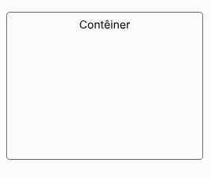
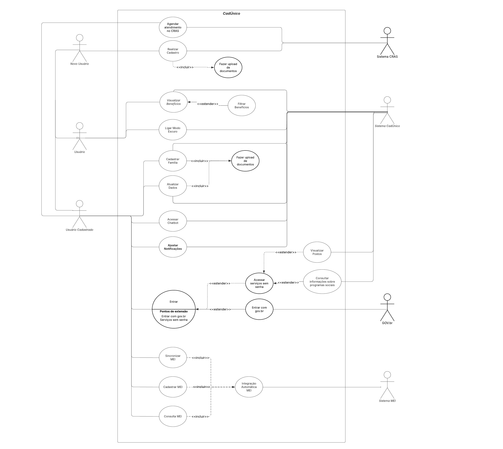

# Casos de Uso

## Funções dos autores

| Nome                                                | Função                                                                                                                             | 
|----------------------                               |----------------------------------------------------------------                                                                    |
| [Amanda Cruz](https://github.com/mandicrz)          | Criação do caso de uso 15                                                                                                          | 
| [Gabriel Flores](https://github.com/Gabrielfcoelho) | Criação dos casos de uso 16 e 17; Criação do diagrama                                                                              | 
| [João Igor](https://github.com/JoaoPC10)            | Criação do caso de uso 14                                                                                                          | 
| [João Pedro Costa](https://github.com/johnaopedro)  | Criação da página; Criação dos casos de uso 10 à 13; Adição de referências e imagens; Correção pelo metodo de Fagan; Revisão geral | 
| [Julia Gabriela](https://github.com/JuliaGabP)      | Criação dos casos de uso 1 à 3, 6 e 7.                                                                                             |
| [Ryan Salles](https://github.com/RA-Salles)         | Revisão geral; Criação dos casos de uso 4, 5, 8 e 9; Criação do diagrama.                                                          | 

     
    Autor(es): 
    <a href="https://github.com/JuliaGabP" target="_blank">Julia Gabriela</a>

## Introdução
Os casos de uso são uma técnica de modelagem que representa uma sequência de interações entre um sistema e um ator(es) externo, culminando em um resultado valioso para o ator. Os nomes dos casos de uso devem ser sempre estruturados como um verbo seguido de um objeto. É importante selecionar nomes fortes e descritivos para deixar evidente, pelo nome, que o caso de uso entregará algo valioso para algum usuário.

## Metodologia

O diagrama de casos de uso é uma representação visual da interação de atores com o sistema e visa facilitar o entendimento de como se dará o uso por parte dos atores primários e como os atores secundários se relacionam às funcionalidades que o sistema apresenta. Para melhor entender a interação do usuário com os sistemas e aplicativo, as personas **Larissa Mendes Costa** e **Beatriz Oliveira Santos** foram utilizadas para modelar os atores *Usuário Cadastrado* e *Novo Usuário*, respectivamente. Para o ator generalizado *Usuário*, ambas as personas foram utilizadas. 

A Tabela 1 apresenta os elementos presentes no diagrama de caso de uso e suas funcionalidades. 

<b>Tabela 1</b>: Elementos do diagrama de casos de uso

| Nome                 | Função                                                            | Elemento
|----------------------|----------------------------------------------------------------   |:-------: |
| Ator                 | Determina algo ou alguém que interagirá com o sistema             |   |
| Elipse (Caso de Uso) | Determina os casos de uso dentro do sistema                       |  |
| Retângulo (Sistema)  | Determina limites do sistema                                      |  |
| Flecha (Relações)    | Determina relações entre os casos de uso ou atores e casos de uso. Pode ser pontilhada.|  |

<!---
We really need to add these images someway somehow. We could use the bilheteria digital model. I hope it works fine.

-l0c.

-->

## Diagrama de Casos de Uso

A Figura 1 apresenta o Diagrama de Casos de Uso elaborado pelo grupo 4. 

 
    <b>Figura 1:</b> Diagrama de Casos de Uso do CádÚnico

<!--
IT IS DONE. FOXTROT FINALLY!

-l0c
-->

    <b>Autor(es):</b> <a href="https://github.com/Gabrielfcoelho" target="_blank"> Gabriel Flores </a>, <a href="https://github.com/RA-Salles" target="_blank"> Ryan Salles </a>

## Casos de Uso

As Tabelas, enumeradas de 2 a 16, definidas como UC01 a UC15 apresentam a especificação de cada caso de uso. 

### [#UC01] Visualização de Benefícios Ativos

<b>Tabela 2:</b> Especificação de visualização de benefíficos ativos

| Campo            | Detalhes |
|------|----------------------------|
| **Descrição** | Permite ao usuário visualizar os benefícios sociais ativos vinculados ao seu cadastro no CadÚnico, como o Bolsa Família. |
| **Ator(es)** | Usuário cadastrado |
| **Pré-condições** | O usuário possui cadastro validado no CadÚnico e está autenticado no aplicativo. |
| **Ação** | O usuário acessa a opção “Meus Benefícios” para verificar seus benefícios ativos. |
| **Fluxo principal** | <ol><li>O usuário acessa o aplicativo do CadÚnico</li><li>Seleciona a opção “Meus Benefícios”</li><li>O sistema busca as informações na base de dados do governo</li><li>É exibida uma lista com nome do programa, status (ativo/suspenso), valor recebido e última atualização</li></ol> |
|**Fluxo de exceção** | <ul><li>Usuário sem benefícios ativos: sistema exibe mensagem informativa</li><li>Falha de comunicação com a base de dados: sistema exibe mensagem de erro</li></ul> |
| **Pós-condições** | O usuário visualiza seus benefícios de forma clara e atualizada. |
| **Data de Criação** | 17/05/2025 |
| **Rastreabilidade** | [RF24](https://github.com/Requisitos-de-Software/2025.1-Cadastro-Unico/blob/main/docs/elicitacao/requisitos_elicitados.md) |

<b>Autora: <a href="https://github.com/JuliaGabP">Julia Gabriela</a></b>

---

### [#UC02] Atualização de Dados Cadastrais

<b>Tabela 3:</b> Especificação de dados cadastrais

| Campo            | Detalhes |
|------|-------------------------------|
| **Descrição** | Permite ao usuário atualizar seus dados pessoais e residenciais no CadÚnico, como endereço e telefone. |
| **Ator(es)** | Usuário cadastrado |
| **Pré-condições** | O usuário está logado no aplicativo e possui cadastro existente. |
| **Ação** | O usuário acessa a seção “Atualizar Cadastro” para alterar informações residenciais. |
| **Fluxo principal** | <ol><li>Usuário acessa o aplicativo</li><li>Vai até a seção “Atualizar Cadastro”</li><li>Seleciona a opção para alterar dados residenciais</li><li>Atualiza endereço, telefone e contato</li><li>Confirma e envia os dados</li><li>O sistema notifica que os dados serão analisados por um agente público</li></ol> |
| **Fluxo de exceção** | <ul><li>CPF com inconsistência: sistema bloqueia alteração e exibe mensagem</li><li>CEP inválido: sistema solicita correção</li></ul> |
| **Pós-condições** | Os dados são enviados para análise e o usuário é notificado que há uma atualização em processamento. |
| **Data de Criação** | 17/05/2025 |
| **Rastreabilidade** | [RF05](https://github.com/Requisitos-de-Software/2025.1-Cadastro-Unico/blob/main/docs/elicitacao/requisitos_elicitados.md) |

<b>Autora: <a href="https://github.com/JuliaGabP">Julia Gabriela</a></b>

---

### [#UC03] Primeiro Cadastro no CadÚnico

<b>Tabela 4:</b> Especificação de primeiro cadastro no sistema

| Campo            | Detalhes |
|------|----------------------------|
| **Descrição** | Permite a novos usuários realizar seu primeiro cadastro no CadÚnico através do aplicativo. |
| **Ator(es)** | Novo usuário |
| **Pré-condições** | O usuário possui documentos válidos e acesso à internet. |
| **Ação** | O usuário realiza o primeiro cadastro preenchendo os dados exigidos pelo sistema. |
| **Fluxo principal** | <ol><li>Usuário instala e abre o aplicativo</li><li>Seleciona a opção “Fazer Primeiro Cadastro”</li><li>Preenche dados pessoais: nome, CPF, nascimento, endereço, composição familiar</li><li>Envia a solicitação</li><li>O sistema gera um protocolo e informa que o usuário será contatado para validação</li></ol> |
| **Fluxo de exceção** | <ul><li>CPF já existente: sistema bloqueia e sugere login</li><li>Dados obrigatórios faltando: sistema impede envio e destaca os campos incompletos</li></ul> |
| **Pós-condições** | Um cadastro preliminar é criado e enviado para avaliação por um agente social. |
| **Data de Criação** | 17/05/2025 |
| **Rastreabilidade** | [RF19](https://github.com/Requisitos-de-Software/2025.1-Cadastro-Unico/blob/main/docs/elicitacao/requisitos_elicitados.md) |

<b>Autora: <a href="https://github.com/JuliaGabP">Julia Gabriela</a></b>

---

### [#UC04] Conferir informações sobre benefícios

<b>Tabela 5:</b> Especificação de consulta de informações sobre benefícios

| UC04 | Conferir informações sobre benefícios|
|------|----------------------------|
| **Descrição**        | Permite aos usuários, com ou sem autenticação, ler sobre os possíveis benefícios disponíveis no aplicativo |
| **Ator(es)**         | Usuário |
| **Pré-condições**    | O usuário possui o aplicativo instalado em seu dispositivo compatível |
| **Ação**             | O usuário confere informações sobre os benefícios e informa-se |
| **Fluxo principal**  | <ol><li>Usuário instala e abre o aplicativo</li> <li>Seleciona a opção "Programas sociais"</li><li> Sistema lista programas sociais com informações disponíveis</li> <li> Usuário clica na opção desejada </li> <li>Sistema lista as informações disponíveis sobre o programa social escolhido </li> </ul> |
| **Fluxo alternativo**| <ol><li>Usuário instala e abre o aplicativo</li> <li>Usuário seleciona opção "logar com GOV.br"</li><li>Usuário conclui autenticação</li> <li>Seleciona a opção "Programas sociais"</li><li> Sistema lista programas sociais com informações disponíveis</li> <li> Usuário clica na opção desejada </li> <li>Sistema lista as informações disponíveis sobre o programa social escolhido </li> </ul> |
| **Fluxo de exceção** | <ul><li>Erro de interface: Sistema lista informações incorretamente ou de forma ilegível</li><li>Sem conexão em computadores: sistema não inicia</li></ul> |
| **Pós-condições**    | O usuário possui informações sobre o programa social escolhido |
| **Data de Criação**  | 17/05/2025 |
| **Rastreabilidade**  | [RF24](https://github.com/Requisitos-de-Software/2025.1-Cadastro-Unico/blob/main/docs/elicitacao/requisitos_elicitados.md) |

<b>Autor: <a href="https://github.com/RA-Salles">Ryan Salles</a></b>

---

### [#UC05] Verificar postos de atendimento

<b>Tabela 6:</b> Especificação de verificação de postos de atendimento

| UC05 | Verificar postos de atendimento |
|------|----------------------------|
| **Descrição**         | Permite aos usuários verificar postos de atendimento disponíveis |
| **Ator(es)**          | Usuário, Sistema CadÚnico|
| **Pré-condições**     | O usuário possui um dispositivo compatível com o aplicativo e acesso à internet. |
| **Ação**              | O usuário confere informações sobre os postos de atendimento disponíveis. |
| **Fluxo principal**   | <ol><li>Usuário instala e abre o aplicativo</li><li>Seleciona a opção “Postos de atendimento”</li><li>Preenche dados para requisição de informação: Estado, Município, Tipo Posto</li><li>Envia a solicitação</li><li>O sistema lista os postos disponíveis</li> <li> Usuário lê informações listadas </li></ol> |
| **fluxo alternativo** | <ol><li>Usuário instala e abre o aplicativo</li><li>Usuário seleciona opção "logar com GOV.br"</li><li>Usuário conclui autenticação</li><li>Seleciona a opção “Postos de atendimento”</li><li>Preenche dados para requisição de informação: Estado, Município, Tipo Posto</li><li>Envia a solicitação</li><li>O sistema lista os postos disponíveis</li> <li> Usuário lê informações listadas </li></ol> |
| **Fluxo de exceção**  | <ul><li> Carregamento infinito: sistema passa um período indeterminado obtendo informações sobre o posto escolhido e demais interações são bloqueadas</li><li>Sem conexão: aplicativo não apresenta opções para requisição em caso de falta de conexão com a internet</li></ul> |
| **Pós-condições**     | O sistema  lista informações sobre os postos disponíveis. |
| **Data de Criação**   | 17/05/2025 |
| **Rastreabilidade**   | [RF16](https://github.com/Requisitos-de-Software/2025.1-Cadastro-Unico/blob/main/docs/elicitacao/requisitos_elicitados.md) |

<b>Autor: <a href="https://github.com/RA-Salles">Ryan Salles</a></b>

---

### [#UC06] Cadastrar família

<b>Tabela 7:</b> Especificação de cadastro familiar

| UC06 | Cadastrar família |
|------|-------------|
| **Descrição** | Permite ao responsável familiar registrar sua família no Cadastro Único para acessar benefícios sociais. |
| **Ator(es)** | Responsável familiar |
| **Pré-condições** | Acesso à internet, posse de documentos da família, uso de smartphone ou computador |
| **Ação** | O usuário realiza o cadastro de sua família |
| **Fluxo principal** | <ol><li>O usuário acessa o aplicativo</li><li>Seleciona a opção "Cadastrar Família"</li><li>Insere os dados pessoais e dos membros da família</li><li>Confirma os dados e envia</li><li>Recebe protocolo de envio</li></ol> |
| **Fluxo alternativo** | <ol><li>CPF do responsável já está vinculado</li><li>Usuário é instruído a buscar suporte</li></ol> |
| **Fluxo de exceção** | <ul><li>Erro de conexão</li><li>Dados incompletos ou inválidos</li><li>Aplicativo informa erro e solicita correção</li></ul> |
| **Pós-condições** | Família registrada como grupo familiar no sistema, com cadastro pendente de validação |
| **Data de Criação** | 13/05/2025 |
| **Rastreabilidade** | [RF01](https://github.com/Requisitos-de-Software/2025.1-Cadastro-Unico/blob/main/docs/elicitacao/requisitos_elicitados.md) |

<b>Autora: <a href="https://github.com/JuliaGabP">Julia Gabriela</a></b>

---

### [#UC07] Filtrar Benefícios Sociais

<b>Tabela 8:</b> Especificação de filtragem de benefícios

| UC07 | Filtrar Benefícios Sociais |
|------|-------------|
| **Descrição** | Permite ao usuário buscar e filtrar informações sobre benefícios sociais disponíveis de acordo com seu perfil ou interesse. |
| **Ator(es)** | Usuário (autenticado ou não) |
| **Pré-condições** | Acesso ao aplicativo e à internet |
| **Ação** | O usuário realiza filtros para buscar benefícios sociais no aplicativo |
| **Fluxo principal** | <ol><li>O usuário acessa o aplicativo</li><li>Navega até a seção “Benefícios Disponíveis”</li><li>Utiliza filtros como tipo de benefício, região, faixa de renda ou público-alvo</li><li>O sistema retorna os benefícios correspondentes</li><li>O usuário visualiza detalhes dos benefícios</li></ol> |
| **Fluxo alternativo** | <ul><li>O usuário usa filtros pré-definidos com base no perfil (ex: famílias com crianças)</li><li>O sistema mostra resultados priorizados</li></ul> |
| **Fluxo de exceção** | <ul><li>Filtro retorna nenhum benefício</li><li>Erro de conexão impede exibição</li><li>Filtros inválidos ou mal preenchidos</li></ul> |
| **Pós-condições** | O usuário visualiza os benefícios sociais de acordo com os filtros aplicados |
| **Data de Criação** | 13/05/2025 |
| **Rastreabilidade** | [RF23](https://github.com/Requisitos-de-Software/2025.1-Cadastro-Unico/blob/main/docs/elicitacao/requisitos_elicitados.md) |

<b>Autora: <a href="https://github.com/JuliaGabP">Julia Gabriela</a></b>

---

### [#UC08] Chatbot

<b>Tabela 9:</b> Especificação de chatbot automatizado

| UC08 | Acessar chatbot |
|------|----------------------------|
| **Descrição**        | Permite aos usuários consultar um assistente virtual configurado para responder questões e dúvidas frequentes |
| **Ator(es)**         | Usuário, Assistente Virtual|
| **Pré-condições**    | O usuário possui um dispositivo compatível com o aplicativo e acesso à internet. |
| **Ação**             | acessar Chatbot |
| **Fluxo principal**  | <ol><li>Usuário instala e abre o aplicativo</li><li>Usuário aperta no botão de "login" </li><li>Usuário preenche informações de login e envia uma solicitação de autenticação</li><li> Usuário é autenticado pelo gov.br</li><li>Usuário aperta no botão "Assistente Virtual" e é movido para a tela do Assistente Virtual</li> <li> Usuário realiza uma pergunta</li> <li>O Assistente Virtual responde a pergunta</li></ol> |
| **Fluxo de exceção** | <ul><li> Usuário não cadastrado: Usuário não consegue acessar a funcionalidade ao não conseguir passar pelo processo de autenticação</li><li>Sem conexão: aplicativo não realiza login ao não possuir conexão com o sistema gov.br</li> <li> Assistente em manutenção: O assistente virtual está em manutenção e está indisponível </li> <li> Assistente não sabe responder: Assistente Virtual não possui informações suficientes para responder ao usuário </li></ul> |
| **Pós-condições**    | O usuário tem sua dúvida esclarecida. |
| **Data de Criação**  | 17/05/2025 |
| **Rastreabilidade**  | [RF26](https://github.com/Requisitos-de-Software/2025.1-Cadastro-Unico/blob/main/docs/elicitacao/requisitos_elicitados.md) |

<b>Autor: <a href="https://github.com/RA-Salles">Ryan Salles</a></b>

---

### [#UC09] Modo Escuro

<b>Tabela 10:</b> Especificação de modo escuro

| UC09 | Ativar modo escuro |
|------|----------------------------|
| **Descrição** | Permite aos usuários ativar um "modo escuro", o qual altera a saturação e luminosidade da interface para uso em ambientes de baixa luminosidade |
| **Ator(es)** | Usuário|
| **Pré-condições** | O usuário possui um dispositivo compatível com o aplicativo|
| **Ação** | ligar modo escuro |
| **Fluxo principal** | <ol><li>Usuário instala e abre o aplicativo</li><li>Usuário aperta no botão de "modo escuro" </li><li>Aplicativo atualiza interface para utilizar cores com menor luminosidade e/ou cores mais frias</li></ol> |
| **Fluxo de exceção** | <ul><li> Cores desagradáveis: O novo esquema de cores torna o usuário mais desconfortável no momento</li><li> Má colocação: Usuário não consegue encontrar o botão "Modo escuro"</li></ul> |
| **Pós-condições** | O usuário se sente mais confortável para utilizar o aplicativo |
| **Data de Criação** | 17/05/2025 |
| **Rastreabilidade** | [RF38](https://github.com/Requisitos-de-Software/2025.1-Cadastro-Unico/blob/main/docs/elicitacao/requisitos_elicitados.md) |

<b>Autor: <a href="https://github.com/RA-Salles">Ryan Salles</a></b>

---

### [#UC10] - Indicação de MEI no momento do cadastro

<b>Tabela 11:</b> Especificação de indicação MEI

| UC10 | Indicação de MEI no momento do cadastro |
|------------------|----------|
| **Descrição**    | Permite que o usuário informe, durante o processo de cadastro no CadÚnico, que é um Microempreendedor Individual (MEI). |
| **Ator(es)**         | Usuário em processo de cadastro |
| **Pré-condições**| Usuário acessando o app e iniciando novo cadastro |
| **Ação**         | Indicação da condição de MEI durante o cadastro |
| **Fluxo principal** | 1. O usuário inicia o cadastro no app CadÚnico 2. Preenche dados pessoais 3. Marca a opção “Sou MEI” 4. Finaliza o cadastro |
| **Fluxo alternativo** | O usuário ignora a opção → sistema registra como não MEI |
| **Fluxo de exceção** | Dados inconclusivos → sistema alerta para verificação posterior |
| **Pós-condições** | A condição de MEI é registrada no perfil do usuário |
| **Data de Criação** | 16/05/2025 |
| **Rastreabilidade** | [RF11](https://github.com/Requisitos-de-Software/2025.1-Cadastro-Unico/blob/main/docs/elicitacao/requisitos_elicitados.md) |

<b>Autor: <a href="https://github.com/johnaopedro">João Pedro</a></b>

---

### [#UC11] - Acesso a informações sobre MEI

<b>Tabela 12:</b> Especificação de acesso a informações MEI

| UC11 | Acesso a informações sobre MEI |
|------------------|----------|
| **Descrição**    | Permite que usuários MEI consultem conteúdos informativos sobre microempreendedorismo no app CadÚnico. |
| **Ator(es)**         | Usuário com perfil MEI |
| **Pré-condições**| Usuário logado com perfil registrado como MEI |
| **Ação**         | Consulta de informações sobre MEI |
| **Fluxo principal** | 1. O usuário acessa a seção “MEI” no app 2. Visualiza temas como obrigações, benefícios, formalização, linhas de crédito 3. Acessa conteúdos de interesse, com links e orientações |
| **Fluxo alternativo** | Perfil não registrado como MEI → sistema exibe convite para formalização |
| **Fluxo de exceção** | Conteúdo indisponível → sistema exibe mensagem informativa |
| **Pós-condições** | O usuário adquire conhecimento sobre seus direitos e deveres como MEI |
| **Data de Criação** | 16/05/2025 |
| **Rastreabilidade** | [RF12](https://github.com/Requisitos-de-Software/2025.1-Cadastro-Unico/blob/main/docs/elicitacao/requisitos_elicitados.md) |

<b>Autor: <a href="https://github.com/johnaopedro">João Pedro</a></b>

---

### [#UC12] - Personalização de conteúdos da seção MEI

<b>Tabela 13:</b> Especificação de personalização MEI

| UC12            | Personalização de conteúdos da seção MEI |
|------------------|----------|
| **Descrição**    | Permite que o sistema personalize os conteúdos exibidos na seção MEI com base no setor de atuação e localização do usuário. |
| **Ator(es)**         | Usuário MEI cadastrado |
| **Pré-condições**| Usuário logado com setor de atuação e município informados |
| **Ação**         | Personalização automática de conteúdos |
| **Fluxo principal** | 1. O usuário acessa a seção “MEI” 2. O sistema identifica setor e região 3. Exibe conteúdos segmentados (editais, obrigações, notícias) 4. Permite interação com os conteúdos |
| **Fluxo alternativo** | Setor não informado → sistema solicita preenchimento complementar |
| **Fluxo de exceção** | Localização não disponível → sistema utiliza município do cadastro |
| **Pós-condições** | O usuário visualiza conteúdos relevantes ao seu perfil |
| **Data de Criação** | 16/05/2025 |
| **Rastreabilidade** | [RF13](https://github.com/Requisitos-de-Software/2025.1-Cadastro-Unico/blob/main/docs/elicitacao/requisitos_elicitados.md) |

<b>Autor: <a href="https://github.com/johnaopedro">João Pedro</a></b>

---

### [#UC13] - Consulta e sincronização automática com a base de dados do MEI

<b>Tabela 14:</b> Especificação de consulta e integração MEI

| UC13           | Consulta e sincronização automática com a base de dados do MEI |
|------------------|----------|
| **Descrição**    | Permite que o CadÚnico sincronize dados MEI com a Receita Federal automaticamente |
| **Ator(es)**         | Sistema do CadÚnico |
| **Pré-condições**| Usuário com CNPJ MEI ativo vinculado ao CPF no CadÚnico |
| **Ação**         | Sincronização automática de dados |
| **Fluxo principal** | 1. Sistema realiza integração periódica com Receita Federal 2. Identifica usuários com CNPJ MEI 3. Recupera dados do MEI (status, atividade, débitos) 4. Atualiza o perfil do usuário no app 5. Notifica o usuário sobre atualizações |
| **Fluxo alternativo** | Dados inconsistentes CPF/CNPJ → alerta técnico para revisão |
| **Fluxo de exceção** | Falha de conexão com Receita → tentativa armazenada e reagendada |
| **Pós-condições** | Perfil MEI atualizado automaticamente no CadÚnico |
| **Data de Criação** | 16/05/2025 |
| **Rastreabilidade** | [RF11, RF13, RF40](https://github.com/Requisitos-de-Software/2025.1-Cadastro-Unico/blob/main/docs/elicitacao/requisitos_elicitados.md) |

<b>Autor: <a href="https://github.com/johnaopedro">João Pedro</a></b>

---

### [#UC14] - Agendamento no CRAS através do aplicativo

<b>Tabela 15:</b> Especificação de agendamento no CRAS

 
| UC14            | Agendamento no CRAS através do aplicativo|
|------------------|----------|
| **Descrição**    | Permite que o usuário realize agendamento de atendimento nos postos do CRAS através do aplicativo CadÚnico |
| **Ator(es)**         | Usuário e Sistema CRAS|
| **Pré-condições**| Usuário com dispositivo compatível com o aplicativo e acesso à internet |
| **Ação**         | Agendar atendimento no CRAS|
| **Fluxo principal** | <ol><li>Usuário instala e abre o aplicativo</li><li>Usuário navega até a seção "Agendar atendimento no CRAS" </li><li>Usuário adiciona as informações necessárias para realizar o agendamento</li><li>O sistema retorna uma mensagem para validar o processo</li></ol> |
| **Fluxo alternativo** | Dados inconsistentes → alerta técnico para revisão |
| **Fluxo de exceção** | Falha de conexão com o sistema CRAS → tentativa armazenada e reagendada |
| **Pós-condições** | Agendamento de atendimento no CRAS realizado |
| **Data de Criação** | 18/05/2025 |
| **Rastreabilidade** | [RF30](https://github.com/Requisitos-de-Software/2025.1-Cadastro-Unico/blob/main/docs/elicitacao/requisitos_elicitados.md) |

<b>Autor: <a href="https://github.com/JoaoPC10">João Igor</a></b>

---

### [#UC15] - Acesso a tutoriais interativos
 

<b>Tabela 16:</b> Especificação de tutorias interativos

| UC15            | Acesso a tutoriais interativos |
|------------------|----------|
| **Descrição**    | Permite que o usuário acesse vídeos e tutoriais interativos para entender como utilizar os programas sociais disponíveis |
| **Ator(es)**         | Usuário e Sistema CadÚnico |
| **Pré-condições**| O sistema possui vídeos e tutoriais explicativos |
| **Ação**         | Acesso a tutoriais interativos e vídeos explicativos sobre programas sociais |
| **Fluxo principal** | 1. Acessa a seção “Tutoriais e Dicas”  2. Sistema exibe uma lista de tutoriais. 3. Escolhe um tutorial para visualizar. 4. Sistema exibe o escolhido. 5. Interage com o conteúdo 6. Aplicativo registra a visualização e sugere outros conteúdos |
| **Fluxo alternativo** | Tutorial não carregar corretamente → Tenta carregar novamente ou oferece uma opção alternativa para visualização |
| **Fluxo de exceção** | Usuário com dificuldades para entender o conteúdo → Sugere um atendimento assistido por chat |
| **Pós-condições** | O usuário visualiza o conteúdo e compreende os programas sociais com facilidade |
| **Data de Criação** | 18/05/2025 |
| **Rastreabilidade** | [RF35](https://github.com/Requisitos-de-Software/2025.1-Cadastro-Unico/blob/main/docs/elicitacao/requisitos_elicitados.md) |

<b>Autor: <a href="https://github.com/mandicrz">Amanda Cruz Lima</a></b>

### [#UC16] - Upload de documentos

<b>Tabela 17:</b> Especificação de upload de documentos

 
| UC16            | Upload de documentos|
|------------------|----------|
| **Descrição**    | Permite que o usuário envie documentos digitalizados (como comprovante de residência, RG, CPF) diretamente pelo aplicativo para complementação do cadastro |
| **Ator(es)**         | Usuário e Sistema CadÚnico|
| **Pré-condições**| O usuário deve estar logado no sistema e com o cadastro iniciado |
| **Ação**         | Enviar documentos por meio da interface do aplicativo|
| **Fluxo principal** | <ol><li>Usuário acessa a etapa de envio de documentos</li><li>O aplicativo exibe uma lista de documentos obrigatórios</li><li>O usuário seleciona e faz o upload dos arquivos do celular</li><li>O sistema valida o formato e o tamanho</li><li>Os documentos são armazenados com sucesso</li></ol>|
| **Fluxo alternativo** | Documento em formato inválido → mensagem de erro e sugestão de formatos suportados|
| **Fluxo de exceção** | Falha de conexão com o sistema CadÚnico → documentos transferidos armazenados |
| **Pós-condições** | Documentos associados ao cadastro do usuário, já estão vinculados ao seu cadsstro|
| **Data de Criação** | 18/05/2025 |
| **Rastreabilidade** | [RF29](https://github.com/Requisitos-de-Software/2025.1-Cadastro-Unico/blob/main/docs/elicitacao/requisitos_elicitados.md) |

<b>Autor: <a href="https://github.com/Gabrielfcoelho">Gabriel Flores</a></b>

### [#UC17] - Notificação de Pendências ou Atualizações

<b>Tabela 18:</b> Especificação de notificação de pendências ou atualizações

| Campo            | Detalhes |
|------------------|---------------------------------------------------------------------------------------------------------------------------------------------------------------------------------------------------|
| **Descrição**    | Permite que o usuário receba notificações automáticas sobre pendências ou atualizações necessárias em seu cadastro, garantindo que esteja sempre informado para manter seus dados regulares e não perder benefícios. |
| **Ator(es)**     | Usuário cadastrado, Sistema CadÚnico |
| **Pré-condições**| O usuário possui cadastro ativo no CadÚnico, está autenticado no aplicativo e tem as notificações habilitadas. |
| **Ação**         | Receber notificação de pendências ou atualizações no aplicativo. |
| **Fluxo principal** | <ol><li>O sistema identifica uma pendência ou atualização necessária no cadastro do usuário.</li><li>O sistema gera e envia uma notificação automática ao usuário.</li><li>O usuário recebe a notificação em seu dispositivo.</li><li>O usuário acessa o aplicativo e visualiza os detalhes da pendência ou atualização.</li><li>O sistema orienta o usuário sobre como regularizar a situação.</li></ol> |
| **Fluxo de exceção** | <ul><li>O usuário não recebe a notificação devido a problemas de conexão ou permissões desativadas.</li><li>O sistema identifica uma pendência, mas não consegue detalhar a ação necessária, solicitando contato com o suporte.</li></ul> |
| **Pós-condições** | O usuário está ciente da pendência ou atualização e pode tomar as ações necessárias para regularizar seu cadastro. |
| **Data de Criação** | 04/07/2025 |
| **Rastreabilidade** | [RF27](https://github.com/Requisitos-de-Software/2025.1-Cadastro-Unico/blob/main/docs/elicitacao/requisitos_elicitados.md) <!-- Substitua RFXX pelo código correto do requisito funcional --> |

<b>Autor: <a href="https://github.com/Gabrielfcoelho">Gabriel Flores</a></b>

---

### Tabela de Rastreabilidade UC-CEN-RF

A tabela de rastrabilidade é apresentada por meio da Tabela 18, que contêm informações de rastreabilidade do caso de uso apresentado e sua relação com o(s) respectivo(s) cenário(s) e requisito(s) funcional(ais).

 <b>Tabela 18: Tabela de Rastreabilidade</b> 

| Caso de Uso (UC) | Cenário (CN) | Requisito Funcional (RF) |
| :------------:   | :--------:   | :--------------------:   |
| UC01             | CN01         | RF24                     |
| UC02             | CN02         | RF05                     |
| UC03             | CN03         | RF19                     |
| UC04             | CN04         | RF24                     |
| UC05             | CN05         | RF16                     |
| UC06             | CN06         | RF01                     |
| UC07             | CN07         | RF23                     |
| UC08             | CN08         | RF26                     |
| UC09             | CN09         | RF38                     |
| UC10             | CN10         | RF11                     |
| UC11             | CN11         | RF12                     |
| UC12             | CN12         | RF13                     |
| UC13             | CN13         | RF11, RF13, RF39         |
| UC14             | CN14         | RF30                     |
| UC15             | CN15         | RF35                     |
| UC16             | CN16         | RF29                     |
| UC17             | CN17         | RF27                     |

 
    <b>Autor(es):</b> <a href= "https://github.com/mandicrz" target="_blank"> Amanda Cruz </a>, <a href= "" target="_blank"> Julia Paulino </a>, , <a href= "https://github.com/Gabrielfcoelho" target="_blank"> Gabriel Flores </a>, <a href= "https://github.com/johnaopedro" target="_blank"> João Pedro </a>, <a href= "https://github.com/JoaoPC10" target="_blank"> João Igor </a>, <a href= "https://github.com/RA-Salles" target="_blank"> Ryan Salles </a> 

## Vídeo de Validação
Uma reunião presencial foi realizada para fins de validação dos casos de uso elaborados. As informações sobre a reunião são apresentadas por meio das tabelas abaixo.

    <b> Tabela 19:</b> Informações da Reunião

| Campo   | Informação                                               |
| :-----: | :------------------------------------------------------: |
| Local   | [UnB - FCTE](https://maps.app.goo.gl/f8bxb23JLZJpw7REA)  |
| Data    | 05/06/2025                                               |
| Horário | 10:30                                                    |
| Duração | Cerca de 5 minutos                                      |

    Autor(es): 
    <a href="https://github.com/johnaopedro" target="_blank">João Pedro Costa</a>

 

    <b> Tabela 20:</b> Participantes da Reunião

| Nome                                         | Função                   |
| :------------------------------------------: | :----------------------: |
| José                                         | Usuário/ Project Owner   |
| [João Pedro](https://github.com/johnaopedro) | Entrevistador            |
| [Julia Gabriela](https://github.com/JuliaGabP) | Secretário/Desenvolvedor |

    Autor(es): 
    <a href="https://github.com/johnaopedro" target="_blank">João Pedro Costa</a>

 

Abaixo está o vídeo de validação dos casos de uso, onde são discutidos os resultados e insights obtidos durante a elaboração dos casos de uso.

<iframe width="560" height="315" src="https://www.youtube.com/embed/jW598mhkr7I?si=cKDcX22bikxkf2f4" title="YouTube video player" frameborder="0" allow="accelerometer; autoplay; clipboard-write; encrypted-media; gyroscope; picture-in-picture; web-share" referrerpolicy="strict-origin-when-cross-origin" allowfullscreen></iframe>

> **Observação:** O vídeo de validação considerado para os casos de uso é apenas o do João Pedro Costa.

## Bibliografia

> WIEGERS, Karl E.; BEATTY, Joy. Software Requirements. 3. ed. Redmond: Microsoft Press, 2013, p. 144-145.

##### Imagem 1: Casos de Uso

    

##### Imagem 2: Casos de Uso

    

## Histórico de Versões

| Versão | Data | Descrição  | Autor        | Revisor |
| :-----: | :----: | :----------: | :------------: | :--------: |
| 1.0 | 16/05/2025 | Criação da pagina e adição de casos de uso 10, 11, 12, 13 | [João Pedro](https://github.com/johnaopedro) |  [Ryan Salles](https://github.com/RA-Salles) |
| 1.1 | 16/05/2025 | Adicionando referencias sobre o tema e imagens| [João Pedro](https://github.com/johnaopedro) |  [Ryan Salles](https://github.com/RA-Salles) |
| 1.2 | 16/05/2025 | Adicionando 5 casos de uso | [Julia Gabriela](https://github.com/JuliaGabP) |  [Ryan Salles](https://github.com/RA-Salles) |
| 1.3 | 17/05/2025 | Adicionando casos de uso 4 e 5 | [Ryan Salles](https://github.com/RA-Salles) | [João Pedro](https://github.com/johnaopedro) |
| 1.4 | 17/05/2025 | Adicionando casos de uso 8 e 9 | [Ryan Salles](https://github.com/RA-Salles) | [João Pedro](https://github.com/johnaopedro) |
| 1.5 | 17/05/2025 | Consertando tabela e casos de uso |[João Pedro](https://github.com/johnaopedro) |[Ryan Salles](https://github.com/RA-Salles) | 
| 1.6 | 18/05/2025 | Adicionando casos de uso 14, padronizando o documento e corrigindo erros| [Gabriel Flores](https://github.com/Gabrielfcoelho) | [João Igor](https://github.com/JoaoPC10) |
| 1.7 | 18/05/2025 | Melhorando seção Metodologia | [Ryan Salles](https://github.com/RA-Salles) | [João Pedro](https://github.com/johnaopedro) |
| 1.8 | 18/05/2025 | Adicionando caso de uso 15 | [Amanda Cruz](https://github.com/mandicrz) | [João Pedro](https://github.com/johnaopedro) |
| 1.9 | 18/05/2025 | Adicionando caso de uso 14 | [João Igor](https://github.com/JoaoPC10) | [Gabriel Flores](https://github.com/Gabrielfcoelho) |
| 2.0 | 18/05/2025 | Adicionadas figuras e diagramas | [Gabriel Flores](https://github.com/Gabrielfcoelho), [Ryan Salles](https://github.com/RA-Salles) | [João Igor](https://github.com/JoaoPC10) |
| 2.1 | 18/05/2025 | Adicionando caso de uso 16 e 17 | [Gabriel Flores](https://github.com/Gabrielfcoelho) | [João Igor](https://github.com/JoaoPC10) |
| 2.2 | 20/05/2025 | Criando tabela de funções | [Julia Gabriela](https://github.com/JuliaGabP) |  [João Pedro](https://github.com/johnaopedro) |
| 2.2 | 22/06/2025 | Correção pelo metodo de inspeção de Fagan | [João Pedro](https://github.com/johnaopedro) | [Ryan Salles](https://github.com/RA-Salles) |
| 2.3 | 05/06/2025 | Adição do vídeo de validação dos casos de uso | [João Pedro](https://github.com/johnaopedro) | [Ryan Salles](https://github.com/RA-Salles) |
